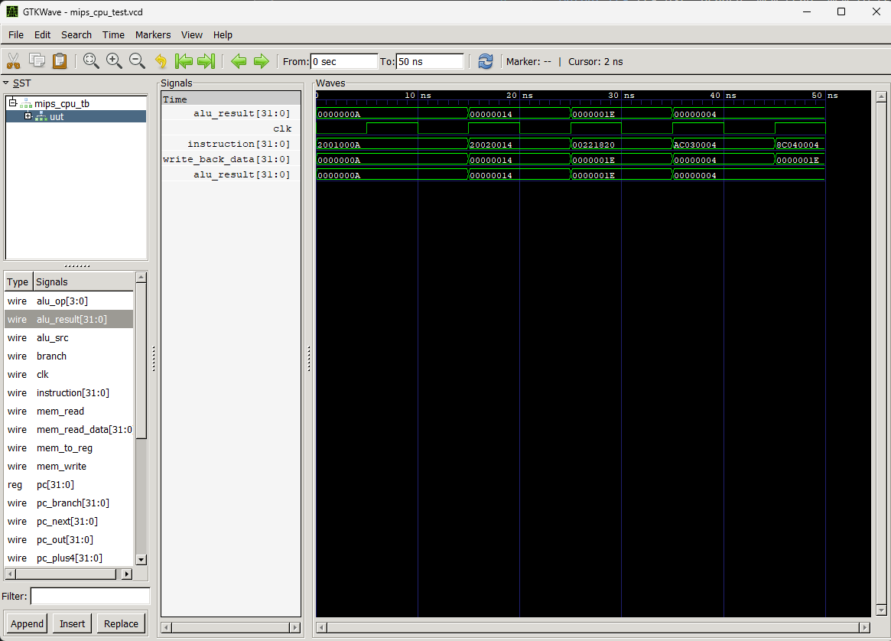

# 32-Bit Single-Cycle MIPS Processor
**Verilog | Computer Architecture | Digital Logic Design**

## Project Overview
Designed and simulated a 32-bit RISC processor based on the MIPS instruction set architecture (ISA). This project implements a complete datapath and control unit capable of executing arithmetic, logical, memory, and branch instructions.

* **Language:** Verilog HDL
* **Simulation Tools:** Icarus Verilog & GTKWave
* **Architecture:** Single-Cycle, Harvard Architecture (Separate Instruction/Data Memory)

## Key Features
* **ALU Design:** Supports `ADD`, `SUB`, `AND`, `OR`, `SLT` operations.
* **Control Unit:** Decodes R-Type, I-Type (LW, SW, ADDI, BEQ) instructions.
* **Hazard Handling:** Implemented "Branch-if-Equal" (BEQ) logic for control flow.
* **Memory Hierarchy:** Modular 32x32 Register File and dual 1KB RAM modules.

## How to Run
1.  **Clone the Repository:**
    ```bash
    git clone [https://github.com/yourusername/mips-processor.git](https://github.com/yourusername/mips-processor.git)
    ```
2.  **Compile the Design:**
    ```bash
    iverilog -o mips_full_sim mips_cpu.v mips_cpu_tb.v alu.v reg_file.v inst_mem.v data_mem.v control_unit.v
    ```
3.  **View Waveforms:**
    ```bash
    vvp mips_full_sim
    gtkwave mips_cpu_test.vcd
    ```

## Verification
**Test Case:** `10 + 20 = 30`
* **Instruction:** `add $3, $1, $2`
* **Waveform Proof:** ALU Result transitions to `0x1E` (30 decimal) at clock cycle 3.


---
*Project created by Saleh Hijazi - 2025*